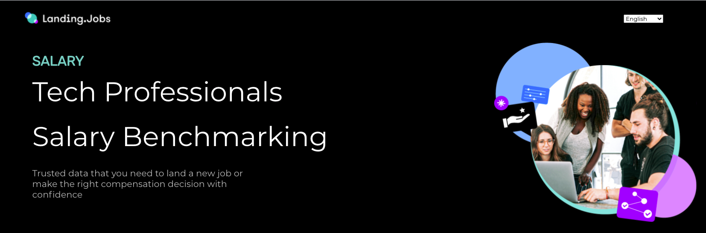
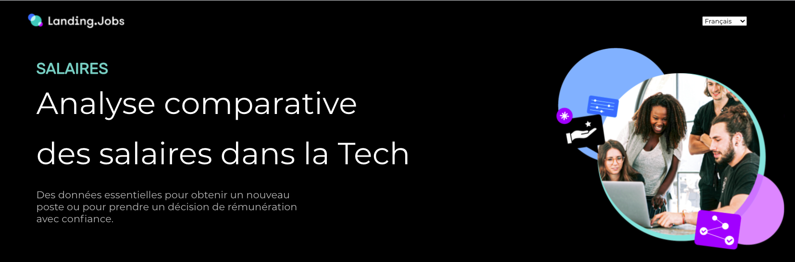
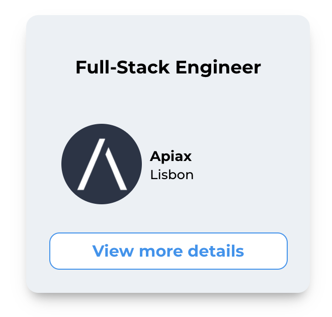

<br />
<p align="center">
  <a href="https://landingsalary.netlify.app/">
    
  </a>

  <h2 align="center">Landing Jobs Salaries</h2>

  <p align="center">
Use our salary benchmark tool to check how your salary compares to that of your peers!
    <br />
    <br />
    <a href="https://landingsalary.netlify.app/">View Demo</a>
    ·
    <a href="https://github.com/Guillaume-Cojan/Landing_jobs/issues">Report Bug</a>
    ·
    <a href="https://github.com/Guillaume-Cojan/Landing_jobs/issues">Request Feature</a>
  </p>
</p>

<p align="center">


 


</p>

<!-- TABLE OF CONTENTS -->
<details open="open">
  <summary><h2 style="display: inline-block">Table of Contents</h2></summary>
  <ol>
    <li><a href="#frontend">Frontend</a>
      <ul>
              <li><a href="#about-the-project">About The Project</a></li>
              <li><a href="#getting-started">Getting Started</a></li>
              <li><a href="#color-reference">Color Reference</a> </li>
              <li><a href="#dependencies">Dependencies</a> </li>
              <ul>
                  <li><a href="#react-i18next">react-i18next</a></li>
                  <li><a href="#react-select">react-select</a></li>
                  <li><a href="#sweet-alert">sweet-alert</a></li>
                  <li><a href="#react-chartjs-2">react-chartjs-2</a></li>
                </ul>
                <li><a href="#apis">APIs</a> </li>
                </ul>
        <li><a href="#backend">Backend</a></li>
     <ul>
        <li><a href="#prerequisites">Prerequisites</a></li>
        <li><a href="#getting-started-backend">Getting Started - Backend</a></li>
      </ul>
    </li>
      <li><a href="#license">License</a></li>
      <li><a href="#acknowledgements">Acknowledgements</a></li>
    <li><a href="#contact">Contact the Developers</a></li>
     <li><a href="#demo">Demo</a></li>
  </ol>
</details>

<!-- ABOUT THE PROJECT -->
## Frontend

---
## About The Project
<br>


A  salary benchmark tool with clean design and easy to use interface, created with React. When setting out to build our product, the vision was clear: an application that requires no unnecessary extra steps, no endless forms to fill-up and no restrictions!

<br />

### Built With

* [React](https://reactjs.org/)
* [Node.js](https://nodejs.dev/)
* [Express](https://expressjs.com/)
* [mySQL](https://www.mysql.com/)


<!-- GETTING STARTED -->
## Getting Started

To get a local copy of the react app up and running follow these simple steps.

1. Clone the project

```bash
  git clone https://github.com/Guillaume-Cojan/Landing_jobs.git
```

2. Go to the project directory

```bash
  cd Landing_jobs
  cd react_app
```

3. Install dependencies

```bash
  npm install
```

4. Start the server

```bash
  npm start
```
5. Happy coding!

<br />

## Color Reference


| Color             | Hex                                                                |
| ----------------- | ------------------------------------------------------------------ |
| Downy|  #73d3ca |
| Cornflower Blue|  #4293ea |
| Dark Orchid |  #a729d2 |
| Black |  #000000 |

<br/>

## Dependencies

### > react-i18next

```bash
  npm install react-i18next i18next --save

 # if you'd like to detect user language and load translation
  npm install i18next-http-backend i18next-browser-languagedetector --save
```

_Learn more about react-i18next : [Documentation](https://react.i18next.com/)_

**Usage**

react-i18next is a powerful internationalization framework for React / React Native which is based on i18next.
The module provides multiple components eg. to assert that needed translations get loaded or that your content gets rendered when the language changes.

<p align="center">



</p>

### > react-select 
### > sweet-alert 

### > react-chartjs-2

```bash
npm install --save react-chartjs-2 chart.js

  # or

yarn add react-chartjs-2 chart.js
```
**Usage**

For this project we used the library's "Vertical Bar Chart" but many more options are available at [React-chartjs-2 Demo](https://reactchartjs.github.io/react-chartjs-2/#/) !

```react
  import { Doughnut } from 'react-chartjs-2';

  <Doughnut data={...} />
```
_Github Source: [React-chartjs-2](https://github.com/reactchartjs/react-chartjs-2)_

## APIs

Our web application makes use of two separate APIs. Firstly, in order to have relevant and up to date job postings on the JobCard components, we use the Landing.Jobs API with the following endpoints:

URL: `https://landing.jobs/api/v1/jobs`

```http
  GET /api/v1/jobs?limit=3&offset=47
```

Example response:

```JSON
[
    {
        "id": 1,
        "city": "East Terry",
        "company_id": 1,
        "country_code": "ML",
        "country_name": "Mali",
        "currency_code": "EUR",
        "expires_at": "2015-05-21",
        "nice_to_have": "Esse veniam vitae. Dolore ipsa sed quam modi quis quidem qui. Culpa facilis illum non. Doloribus est eum sit.",
        "perks": "Officiis aut fugiat temporibus consequatur perspiciatis sint cumque.",
        "published_at": "2015-02-09T18:34:30.270Z",
        "reward": 500,
        "remote": false,
        "relocation_paid": false,
        "role_description": "---\n- Autem nemo quia recusandae harum consequatur eos. Recusandae iure quia modi qui.\n ",
        "salary_low": null,
        "salary_high": null,
        "successful?": false,
        "title": "Regional Creative Specialist",
        "work_from_home": false,
        "created_at": "2015-02-09T18:34:30.270Z",
        "updated_at": "2015-02-12T19:01:56.042Z",
        "type": "Contract",
        "tags": [
            "Arduino",
            "Oberon"
        ]
    },
    {
        "id": 2,
        "city": "Port Timothyland",
        "company_id": 1,
        "country_code": "ML",
        "country_name": "Mali",
        "currency_code": "EUR",
        "expires_at": "2015-02-11",
        "nice_to_have": "Amet nemo quia temporibus officiis vero et.",
        "perks": "Quibusdam adipisci aspernatur aut amet dignissimos nihil asperiores.",
        "published_at": "2015-02-11T13:17:01.621Z",
        "reward": 900,
        "remote": false,
        "relocation_paid": false,
        "role_description": "---\n- Neque nobis ut enim porro autem. Voluptatem nulla et quia. Tenetur enim fugiat quo\n  praesentium eos amet aliquam. Sit facilis tempore quidem quas explicabo ipsam sed.\n",
        "salary_low": null,
        "salary_high": null,
        "successful?": false,
        "title": "Dynamic Infrastructure Liason",
        "work_from_home": false,
        "created_at": "2015-02-11T13:17:01.621Z",
        "updated_at": "2015-02-12T19:01:56.042Z",
        "type": "Part-time",
        "tags": [
            "Lisp",
            "LPC",
            "xBase"
        ]
    },
    {
        "id": 3,
        "city": "Botsfordborough",
        "company_id": 1,
        "country_code": "ML",
        "country_name": "Mali",
        "currency_code": "EUR",
        "expires_at": "2015-04-01",
        "nice_to_have": "Excepturi ratione debitis nulla.",
        "perks": "Blanditiis vel ea suscipit et quae. Eveniet magnam pariatur ullam rem ut.",
        "published_at": "2015-02-11T00:28:01.683Z",
        "reward": 600,
        "remote": false,
        "relocation_paid": false,
        "role_description": "---\n- A aut itaque magni ut. Voluptas quos qui ullam mollitia animi nam. Et qui voluptatibus.\n",
        "salary_low": null,
        "salary_high": null,
        "successful?": false,
        "title": "Corporate Infrastructure Liason",
        "work_from_home": false,
        "created_at": "2015-02-11T00:28:01.683Z",
        "updated_at": "2015-02-12T19:01:56.042Z",
        "type": "Freelance",
        "tags": [
            "Go",
            "JScript",
            "Slate"
        ]
    }
]
```


This GET request with pagination set to the last page will ensure that our website will display the most recent last 3 job postings. However, the object received only contains a company_id, so another fetch is necessary in order to display the company name and logo on our Job Cards.

URL: `https://landing.jobs/api/v1/companies/[id]`

```http
  GET /api/v1/companies/[id]
```

Example response:
```JSON
{
    "id": 1,
    "name": "Hackett, Treutel and Hartmann",
    "description": "facilitate supply-chains",
    "logo_url": "https://example.jpg",
    "website_url": "http://cristnienow.info/alyon",
    "created_at": "2015-02-12T19:01:34.529Z",
    "updated_at": "2015-02-12T19:01:34.529Z"
}
```
Result:

<p align="center">
   
</p>

_For more information: [Landing.Jobs API Documentation](https://github.com/LandingJobs/LandingJobs-api)_

Secondly, Landing.Jobs Salary uses an API developed by us which retrieves the salary data necessary in order to generate a result when the user presses the "Calculate" button.

URL: `https://landing-pay-server.herokuapp.com/salarybenchmark/`

```http
  POST /salarybenchmark/
```

Example response:
```JSON
{
    "average_salary": 32500.00,
    "maximum_salary": 32500,
    "minimum_salary": 32500
}
 ```

<br/>

---

## Backend
<!-- FOR BACKEND -->
### Prerequisites

Here is a list things you need in order to use the web application and how to install them.
* npm
  ```sh
  npm install npm@latest -g
  ```
* [node.js](https://nodejs.org/en/download/)
* [mySQL](https://dev.mysql.com/downloads/installer/)

### Getting Started - Backend

1. Clone the repo
   ```sh
   git clone https://github.com/Guillaume-Cojan/Landing_jobs.git
   ```

2. Go to the project directory
```sh
  cd Landing_jobs
  cd backend
```

3. Install NPM packages
   ```sh
   npm install
   ```

4. Create your own .env file with your mySQL credentials
 ```javascript
      DB_HOST= 
      DB_PORT=
      DB_USER=
      DB_PASSWORD=
      DB_NAME=
```
4. Happy coding!

<!-- LICENSE -->
## License

Distributed under the Landing.Jobs License.

<p align="center">
 
</p>

<!-- ACKNOWLEDGEMENTS -->
## Acknowledgements

Many thanks to our amazing client [Landing.Jobs](https://landing.jobs/) for offering us this opportunity to work on an exciting tool for both tech talents and companies! 

<p align="center">
 
</p>

<!-- CONTACT -->
## Contact The Developers

Anna Gosme - [Github](https://github.com/AnnaGosme) - [LinkedIn](https://www.linkedin.com/in/anna-gosme/)  

Carmen Llamas - [Github](https://github.com/makrmeen) - [LinkedIn](https://www.linkedin.com/in/makarmeen/)

Guillaume Cojan - [Github](https://github.com/Guillaume-Cojan) - [LinkedIn](https://www.linkedin.com/in/guillaumecojan/)

Anca Gheorghe - [Github](https://github.com/anca2196) -  [LinkedIn](https://www.linkedin.com/in/anca-laura-gheorghe/)

<p align="center">
 
</p>

## Demo

Click on the logo in order to view our app. Enjoy! 😊

<p align="center">
  <a href="https://landingsalary.netlify.app/">
    
  </a>
</p>